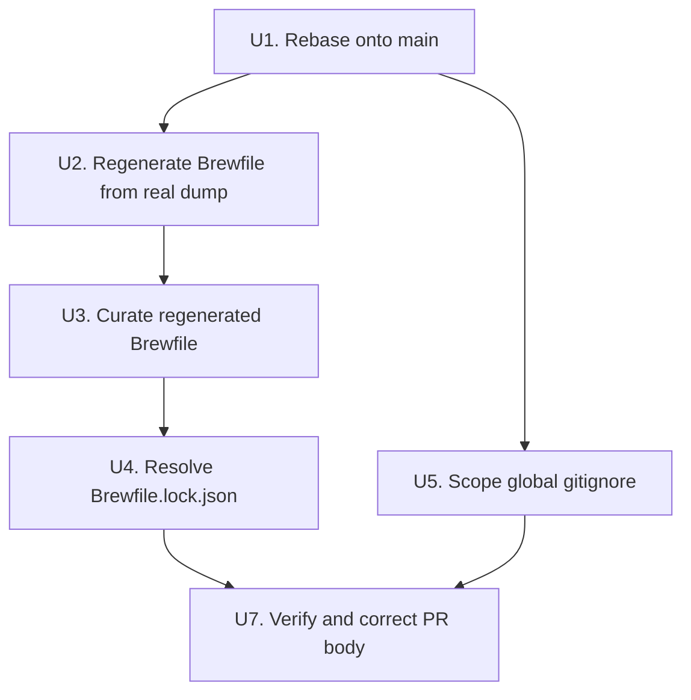
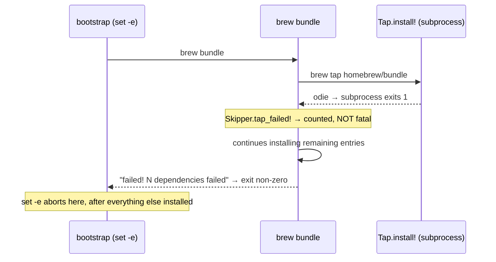

# Brewfile Bootstrap Repair and Global Gitignore Scoping - Plan

## Goal Capsule

**Objective:** Make PR #3 land such that a fresh machine running the external bootstrap script (`soxhub/twokul-claude-skills#2` → clone → `make` → `brew bundle`) completes with exit code 0, and the global gitignore stops silently swallowing files in repos that track them.

**Authority hierarchy:** This plan → the PR's stated intent (a Brewfile that reflects the real machine) → the original code review findings. Where this plan contradicts the review, this plan wins — two review claims were corrected by reading Homebrew 6.0.12 source (see KTD1 and Risks).

**Stop conditions:** Stop and surface if (a) `brew bundle dump` on the current machine produces a file whose curation would drop tooling the user actively depends on, or (b) the rebase in U1 surfaces conflicts beyond `git/.gitignore.global`.

**Execution profile:** Mechanical repair with verification gates. No new abstractions. Every unit is verifiable by running a command and reading its exit code.

**Tail ownership:** The implementer owns rebase, commits, and force-push to the existing branch. Merging PR #3 is not authorized by this plan.

---

## Product Contract

### Summary

Repair the Brewfile so `brew bundle` exits 0 on a machine with no prior Homebrew state, narrow four over-broad patterns in `git/.gitignore.global`, and rebase the branch onto `main` so the `agentic-setup.md` conflict is resolved once.

### Problem Frame

PR #3 claims the Brewfile was regenerated via `brew bundle dump --force` on the current machine. It was not. The evidence is unambiguous:

- The file lists 13 taps. Eight of them (`derailed/k9s`, `git-chglog/git-chglog`, `go-swagger/go-swagger`, `gobuffalo/tap`, `hashicorp/tap`, `kitlangton/tap`, `norwoodj/tap`, `tilt-dev/tap`) are not tapped on this machine. Twelve taps that *are* tapped (`anomalyco/tap`, `humanlayer/humanlayer`, `max-sixty/worktrunk`, `openclaw/tap`, `planetscale/tap`, `schpet/tap`, `shopify/shopify`, `stripe/stripe-cli`, `supabase/tap`, `tw93/tap`, `xdevplatform/tap`, `yakitrak/yakitrak`) are absent from the file.
- `pnpm`, `libpq`, `mysql-client@8.4`, and `postgresql@18` are all installed via Homebrew on this machine and absent from (or removed by) the Brewfile.

The file is a merge of an older dump and hand edits. That root cause explains most of the individual defects downstream of it, and it is why this plan regenerates rather than patches.

Separately, the PR appends six patterns to the *global* excludes file. That file is already symlinked to `~/.gitignore.global` and wired in as `core.excludesfile`, so merging this PR activates the patterns across every repo on the machine the moment it lands — the harm is prospective, not present, but there is no further gate after merge.

Four of the appended patterns — `.claude/`, `CLAUDE.md`, `plans`, `todos` — are unanchored or repo-agnostic. Nine local repos track files matching them: eight track `.claude/` or `CLAUDE.md` (`humanlayer` alone has 43), and two track paths under a `plans` or `todos` directory (`crypto-trading-research` has 38 and appears in both sets). The remote `soxhub/twokul-claude-skills` repo — the one this PR's bootstrap depends on — consists almost entirely of such files. Already-tracked files stay tracked, so nothing breaks loudly; new files are dropped by `git add` with no error, which is the failure mode that costs the most time to diagnose.

### Requirements

**Bootstrap correctness**

R1. `brew bundle` against the repo Brewfile exits 0 on a machine with no pre-existing taps.
R2. Every `tap` entry in the Brewfile is a tap that can actually be tapped today — no entry in Homebrew's `DEPRECATED_OFFICIAL_TAPS`.
R3. Every `brew`, `cask`, `go`, `cargo`, `npm`, and `uv` entry resolves without credentials the bootstrap does not have.
R4. Formulae that come from a third-party tap are tap-qualified and carry `trusted: true`, matching the convention already used at `Brewfile:159,161,163,165`.
R5. The Brewfile reflects the tooling actually installed on the source machine, including `pnpm` and the client libraries `diesel_cli` links against.

**Global gitignore scoping**

R6. No pattern in `git/.gitignore.global` silently excludes files that other repositories on the machine track.
R7. Patterns intended to match a directory are anchored and marked as directories, not bare words matching at any depth.
R8. Entries that cannot achieve their stated purpose are removed rather than left as decoration.

**Merge state**

R11. The branch rebases cleanly onto `main` before the fix commit, so the `git/.gitignore.global` conflict is resolved once.

### Scope Boundaries

In scope: `Brewfile`, `Brewfile.lock.json`, `git/.gitignore.global`, a new repo-local `.gitignore`, and the PR #3 description.

Out of scope:
- **All changes to `zsh/zshrc`.** PR #3 stays at two files plus the new `.gitignore`. The Brewfile↔zshrc mismatches are real but belong in their own change — see Deferred below.
- The `zsh/zshrc` secrets extraction. Already done — the five keys live in `~/.zshrc.local` (mode 600) with a guarded `source` line at the end of `zsh/zshrc`. Key rotation is the user's call and is not tracked here.
- The external bootstrap script in `soxhub/twokul-claude-skills#2`. This plan makes the Brewfile safe for it; it does not modify it.
- `Makefile:11`'s unconditional `git clone` of the alacritty theme repo, which fails on any re-run. Real, unrelated to this PR.

#### Deferred to Follow-Up Work

**Brewfile↔zshrc consistency — its own change, after this PR lands.** Two mismatches, both real, neither blocking the bootstrap:

- *Postgres.* `Brewfile:109` installs `postgresql@17` with `link: true`, which already puts its binaries in `/opt/homebrew/bin`. `zsh/zshrc:83` prepends `postgresql@16/bin` — not installed on this machine at all, so that line is dead today, not just on a fresh machine — and the working tree adds an `@18` prepend. Both prepends are redundant given `link: true` and should come out. The open question is whether the Brewfile should install `@18` instead: it *is* installed here, so if an 18 client is in active use, the follow-up changes the Brewfile rather than just the zshrc. Do not assume 17 without checking.
- *pnpm.* `zsh/zshrc:18` and `zsh/zshrc:53` both alias `p="pnpm"` (a duplicate worth collapsing). `pnpm` is installed via Homebrew at `/opt/homebrew/Cellar/pnpm/11.15.1`, so U2's regeneration should restore `brew "pnpm"` to the Brewfile and the alias will resolve. If it does not survive the dump, the follow-up needs either that entry or a `corepack enable` step — `corepack` is currently not on PATH despite `npm "corepack"` being in the Brewfile.

Requirement IDs R9 and R10 were assigned to this work and are retired from this plan's active scope. They are not reused.

**Curating the 78 `vscode` extension entries.** Noise but harmless — VS Code extension installs do not fail the bundle.

---

## Planning Contract

### Key Technical Decisions

**KTD1. Regenerate the Brewfile from a real dump, then curate — rather than hand-patching the eight broken entries.**

Hand-patching fixes the symptoms and leaves the cause. After patching, the file would still list eight taps the machine does not have, still omit twelve it does, and still be missing `pnpm` and `libpq`. The PR's own description would still be false. A regenerate-then-curate pass makes the file match its claim, and curation is where the judgment goes (dropping private repos, dropping deprecated taps) rather than in reconstructing what is installed.

Cost: the diff gets larger and needs a real read-through. That is the correct trade for a file whose entire job is to reproduce a machine.

**KTD2. The three deprecated tap entries are deleted, not replaced.**

`homebrew/bundle` and `homebrew/services` are not merely deprecated — `brew bundle` and `brew services` are core commands in Homebrew 6.0.12 (`/opt/homebrew/Library/Homebrew/cmd/bundle.rb` exists as a core command file). Tapping them is unnecessary as well as fatal. `homebrew/cask-fonts` is deprecated because fonts migrated into `homebrew/cask`; the 14 unqualified `cask "font-*"` entries at `Brewfile:170-183` already resolve from `homebrew/cask` without it.

**KTD3. Private `soxhub` Go tools move to an untracked work-machine overlay, not into the tracked Brewfile.**

`go "github.com/soxhub/galaxy-cli"` and `go "github.com/soxhub/identity-service"` need org credentials and `GOPRIVATE`. A public dotfiles repo cannot carry entries only one machine can satisfy. Deleting them outright loses real tooling on the work machine, so the plan writes `Brewfile.work` (gitignored) and leaves applying it to the user.

Alternative rejected: `GOPRIVATE` plus credential setup in the bootstrap. That makes a public bootstrap script depend on private org access to exit 0.

**KTD4.** *(retired — the Postgres/zshrc alignment moved to Deferred to Follow-Up Work. ID not reused.)*

**KTD5. `.claude/` and `CLAUDE.md` are removed from the global excludes; `plans` and `todos` are anchored and scoped to this repo.**

`.claude/` and `CLAUDE.md` are authored, committed content in eight local repos, and `soxhub/twokul-claude-skills` — the repo whose bootstrap script motivates this PR — is made almost entirely of them. A machine-global ignore for a file type the user authors and commits is backwards; per-repo `.gitignore` is the right layer.

`plans` and `todos` as bare words match a file or directory of that name at any depth in any repo. `crypto-trading-research` tracks 38 files under such directories. If the user wants them ignored in *this* repo, they belong in a repo-local `.gitignore` as `/plans/` and `/todos/`. Note this plan itself writes to `docs/plans/`, which the unanchored pattern would match.

**KTD6. The `.zshrc.local` entry is deleted rather than corrected.**

It cannot work where it sits: `$HOME` is not a git repository, so the global excludes file is never evaluated against `~/.zshrc.local`. The real protection is the file living outside any repo, which is already true. Keeping a no-op line invites the belief that a control exists.

### Assumptions

- `brew bundle dump --force` on the current machine captures the intended tooling set. If the machine carries formulae installed for a one-off experiment, curation in U3 catches them — the implementer should read the regenerated diff, not accept it blind.
- The user wants the Brewfile to describe *this* machine. If the intent is instead a minimal curated bootstrap list, KTD1 is wrong and the work is smaller.

### Open Questions

- **OQ2 (deferred, not blocking):** Whether `Brewfile.lock.json` should be regenerated or dropped from tracking. U4 recommends dropping it; see that unit for the reasoning.

*(OQ1 covered Postgres 17 vs 18 and moved to Deferred to Follow-Up Work with the rest of the zshrc alignment. ID not reused.)*

### High-Level Technical Design

Sequencing matters here — the rebase must land before the content commits, or the `git/.gitignore.global` conflict gets resolved twice.

How `brew bundle` actually fails is worth stating, because it changes what "broken" means and the original review overstated it:

Directional only — the prose above is authoritative.

---

## Implementation Units

### U1. Rebase the branch onto main

**Goal:** Resolve the `git/.gitignore.global` conflict once, before any fix commits are written on top of it.

**Requirements:** R11

**Dependencies:** none

**Files:** `git/.gitignore.global`

**Approach:** The branch forked at `887d7b4`. `main`'s `eeb2950` appended `agentic-setup.md` immediately after `target` — the same insertion point this PR uses. Rebase `chore/brewfile-refresh-and-secrets-ignore` onto `main` and resolve by keeping both: `agentic-setup.md` from `main`, then the PR's block below it. Force-push the branch.

**Verification:** `gh pr view 3 --json mergeable` reports `MERGEABLE`, not `CONFLICTING`. `git log --oneline main..HEAD` shows the branch's commits sitting on top of `eeb2950`.

**Test expectation:** none — no behavioral change, this is history repair.

---

### U2. Regenerate the Brewfile from a real dump

**Goal:** Replace the merged-dump-plus-hand-edits file with an actual capture of the machine's state, as the PR description already claims.

**Requirements:** R5

**Dependencies:** U1

**Files:** `Brewfile`

**Approach:** Run `brew bundle dump --force` from the repo root against the current machine. Do not curate in this unit — commit the raw capture separately from the curation in U3 so the diff review can distinguish "what the machine has" from "what we decided to change." This is the unit that fixes the root cause identified in the Problem Frame.

Preserve the file's leading comment block if one exists in the current version; `dump` will not regenerate hand-written comments.

**Verification:** `grep -c '^tap ' Brewfile` matches `brew tap | wc -l`. `grep '^brew "pnpm"' Brewfile` returns a hit (it is installed at `/opt/homebrew/Cellar/pnpm/11.15.1` and was missing before). `grep '^brew "libpq"' Brewfile` returns a hit.

**Test expectation:** none — mechanical capture; U3 and U7 carry the behavioral verification.

---

### U3. Curate the regenerated Brewfile

**Goal:** Remove entries that cannot succeed on a fresh machine, and qualify the ones that need a tap.

**Requirements:** R2, R3, R4

**Dependencies:** U2

**Files:** `Brewfile`, `Brewfile.work` (new, untracked)

**Approach:** Six edits against the regenerated file.

1. Delete any `tap` line whose repository appears in `DEPRECATED_OFFICIAL_TAPS` (`/opt/homebrew/Library/Homebrew/official_taps.rb`). On this machine that is `homebrew/bundle` and `homebrew/services`; `homebrew/cask-fonts` will not survive the dump since it is not tapped. Per KTD2 these are deletions, not replacements.
2. Tap-qualify `mole` as `brew "tw93/tap/mole", trusted: true`, matching the existing convention at `Brewfile:159,161,163,165`. Confirmed source: its install receipt records `source tap: tw93/tap`, and `brew info mole` refuses to load it as untrusted.
3. Drop `link: false` from the `pre-commit` entry so the binary lands on PATH. Re-add the flag only if a fresh install reports a real link conflict.
4. Delete `go "template-service/main"` — not a module path (`missing dot in first path element`).
5. Move `go "github.com/soxhub/galaxy-cli"` and `go "github.com/soxhub/identity-service"` into a new `Brewfile.work`, per KTD3.
6. Resolve `go "github.com/gobuffalo/buffalo-pop/v3"` — the module root is a library, not `package main`. Find the command subpath from the module's own package listing or pkg.go.dev and use it; if no `main` package exists, delete the entry. Do not guess a subpath.

**This unit also creates the repo-local `.gitignore`,** which does not currently exist — the repo tracks only five root files and has no ignore file of its own. U3 creates it with the `Brewfile.work` entry; U4 and U5 append to it. Naming the owner here avoids three units racing to create the same file.

Also pin `cargo "diesel_cli"` to the features whose client libraries the Brewfile actually installs, or ensure `libpq` and a MySQL client are present. The regenerated file from U2 should carry `libpq` and `mysql-client@8.4` since both are installed here; verify rather than assume.

**Patterns to follow:** The `trusted: true` convention at `Brewfile:159-165`.

**Test scenarios:**
- `brew bundle check --verbose` reports no missing dependencies on the current machine (proves nothing was dropped that is actually installed).
- Every `^tap ` line cross-checked against `DEPRECATED_OFFICIAL_TAPS` returns zero matches.
- `grep 'soxhub' Brewfile` returns nothing; `grep 'soxhub' Brewfile.work` returns two entries.
- `grep 'template-service' Brewfile` returns nothing.
- `git check-ignore Brewfile.work` exits 0.

**Verification:** No entry in the tracked Brewfile requires credentials, a deprecated tap, or an invalid module path.

---

### U4. Resolve Brewfile.lock.json

**Goal:** Stop shipping a lock file that contradicts the Brewfile beside it.

**Requirements:** R5

**Dependencies:** U3

**Files:** `Brewfile.lock.json`, `.gitignore`

**Approach:** The tracked lock is from Nov 2023 and pins `homebrew/cask-versions`, `homebrew/cask`, `homebrew/core`, `rustup-init`, and 19 brews that no longer appear in the Brewfile.

Recommended: delete it from tracking and append `Brewfile.lock.json` to the repo-local `.gitignore` created in U3. `brew bundle` regenerates it locally on every run, and for a single-user dotfiles repo it pins nothing anyone consumes — it is generated state that will drift again the moment the Brewfile changes.

Alternative if the user wants reproducibility: regenerate it in the same commit as U3 and accept that it needs regenerating on every future Brewfile edit. Recorded as OQ2.

**Test scenarios:**
- After the change, `git status --short` is clean following a `brew bundle` run (proves the lock no longer produces spurious diffs).

**Verification:** No tracked file describes a Brewfile state that does not exist.

---

### U5. Scope the global gitignore patterns

**Goal:** Stop the global excludes file from silently dropping files that nine repositories on this machine track.

**Requirements:** R6, R7, R8

**Dependencies:** U1

**Files:** `git/.gitignore.global`

**Approach:** Four changes to the block this PR appends, per KTD5 and KTD6.

1. Remove `.claude/` and `CLAUDE.md`. These are authored, committed content in ten local repos.
2. Remove `plans` and `todos`. If the user wants them ignored in this repo specifically, append `/plans/` and `/todos/` to the repo-local `.gitignore` created in U3 — anchored with a leading slash and marked as directories with a trailing slash. Note that `docs/plans/` (where this plan lives) would not be matched by `/plans/`, which is the point of anchoring.
3. Remove `.zshrc.local` (KTD6 — it is a no-op where it sits).
4. Review `.plan` in the same block. It is unanchored and would match a `.plan` file at any depth. Anchor it as `/.plan` or drop it on the same reasoning.

The remaining appended entries — `cjs-to-esm-ts.js`, `rename-js-to-mjs.js`, `.cursor`, `.github/instructions` — are out of this unit's scope. `.cursor` carries the same repo-agnostic concern as `.claude/` but the user has not flagged it; leave it and mention it in the PR description.

**Test scenarios:** Note the ordering constraint — the symlinked global file currently holds `main`'s version, so these patterns are not yet active. Demonstrate the regression against the branch's file explicitly rather than assuming the current shell shows it.

- Regression demo (run before the fix): point `core.excludesfile` at a scratch copy of the branch's `git/.gitignore.global` via `GIT_DIR`-independent `git -c core.excludesfile=<scratch> -C ~/code/humanlayer check-ignore -v CLAUDE.md` — it returns a match, proving the pattern would fire on merge.
- After the fix, the same command against the corrected file exits non-zero for `CLAUDE.md` in `~/code/humanlayer`.
- Same before/after pair for a tracked path under a `plans` directory in `~/code/crypto-trading-research`.
- `git -C ~/code/dotfiles check-ignore -v docs/plans/2026-07-29-001-fix-brewfile-bootstrap-and-gitignore-scope-plan.md` exits non-zero — this plan file is itself the regression case for the unanchored `plans` pattern.
- Across the nine affected repos, `git status --short` after the fix shows no files appearing that a merged-as-written PR would have hidden.

**Verification:** No pattern in the global file matches content tracked by another repository.

---

### U7. Verify and correct the PR description

**Goal:** Prove the bootstrap claim rather than asserting it, and make the PR body match what the branch actually does.

**Requirements:** R1, R3

**Dependencies:** U4, U5

**Files:** none in-repo — this unit produces the PR description and the verification evidence.

**Approach:** The honest check is `HOMEBREW_BUNDLE_NO_UPGRADE=1 brew bundle check --verbose` plus a per-entry dry-run of the entries that cannot be verified from installed state — the `go` and `cargo` entries, which are the ones that fail against a remote. For each remaining `go` entry, confirm the module path resolves: `go list -m <path>@latest`. Do not run the actual installs.

A true clean-machine test needs a fresh Homebrew prefix, which is not worth the time here. State that limitation in the PR rather than claiming a clean-machine test that did not happen.

Then correct the PR description on three counts:

- It names `AUTHY_KEY` and `ANTHROPIC_BASE_URL` as the held-back secrets. The actual keys were `ROBINHOOD_API_KEY`, `ROBINHOOD_PRIVATE_KEY`, `FINNHUB_API_KEY`, `LINEAR_API_KEY`, and `FIRECRAWL_API_KEY`, and they have already been moved to `~/.zshrc.local`.
- Drop the `~/.zshrc.local` ignore claim — U5 removes that entry as a no-op, so the PR no longer does what the description says.
- Replace the "Deliberately NOT included" section: the `zsh/zshrc` change it promised is no longer a follow-up commit on this branch. The secrets move is done; the Brewfile↔zshrc alignment is a separate change. Say that.

**Test scenarios:**
- `brew bundle check --verbose` exits 0.
- Every `go` entry's module path resolves via `go list -m <path>@latest`.
- `gh pr view 3 --json mergeable` reports `MERGEABLE`.

**Verification:** The PR description describes only changes the branch actually contains.

---

## Verification Contract

This repo has no test framework. Verification is behavioral, run from the repo root:

| Gate | Command | Pass condition |
|---|---|---|
| Bundle resolves | `brew bundle check --verbose` | exit 0 |
| No deprecated taps | `grep '^tap ' Brewfile` cross-checked against `DEPRECATED_OFFICIAL_TAPS` | zero matches |
| No credentialed entries | `grep -E 'soxhub' Brewfile` | no output |
| Go entries valid | `go list -m <path>@latest` per `go` entry | all resolve |
| Global ignore scoped | `git -C <repo> check-ignore -v <tracked path>` across the nine affected repos | exits non-zero everywhere |
| Mergeable | `gh pr view 3 --json mergeable` | `MERGEABLE` |
| No zshrc drift | `git diff --name-only main...HEAD` | does not list `zsh/zshrc` |

**Known gap:** R1 asserts a clean-machine exit code, and none of these gates prove it — they all run against a machine that already has the taps and formulae installed. They prove the weaker claim that no entry is malformed, credentialed, deprecated, or unresolvable. Closing the gap properly needs a fresh Homebrew prefix or a container, which is out of proportion to this PR. U7 requires stating that limitation in the PR description rather than implying a clean-machine test happened.

---

## Definition of Done

**Global:**
- All seven Verification Contract gates pass.
- PR #3 reports `MERGEABLE` and its description matches the branch contents.
- No file tracked by this repo contains a credential.
- No experimental or dead-end edits remain in the diff — in particular, no commented-out Brewfile entries left as breadcrumbs.

**Per unit:**
- U1 — branch sits on top of `eeb2950`; conflict resolved keeping both `agentic-setup.md` and the PR block.
- U2 — Brewfile tap count matches `brew tap`; `pnpm` and `libpq` present.
- U3 — zero deprecated taps, zero `soxhub` entries, `mole` tap-qualified and trusted, `template-service/main` gone, `buffalo-pop` resolved or removed.
- U4 — `Brewfile.lock.json` either regenerated in the same commit as U3 or untracked and gitignored.
- U5 — `.claude/`, `CLAUDE.md`, `plans`, `todos`, `.zshrc.local` removed from the global file; `check-ignore` passes in all nine affected repos.
- U7 — verification evidence captured in the PR description, including the note that no true clean-machine test was run, and `zsh/zshrc` absent from the branch diff.

---

## Risks & Dependencies

**Two corrections to the original review.** Both were verified against Homebrew 6.0.12 source and change how urgent the findings are:

- The review said the deprecated taps make `brew bundle` "abort" and a `set -e` bootstrap stop. It does not abort at that point. `Bundle::Tap.install!` (`/opt/homebrew/Library/Homebrew/bundle/tap.rb`) shells out via `Bundle.brew("tap", ...)`, so `odie` kills a *subprocess*. The failure is recorded by `Skipper.tap_failed!` and counted; `brew bundle` installs everything else and exits non-zero at the end. The bootstrap still fails — but after installing, not instead of installing. This makes the bug less destructive than reported and does not change the fix.
- The review implied the `homebrew/cask-fonts` failure would cascade to the font casks. It does not. All 14 `cask "font-*"` entries are unqualified and resolve from `homebrew/cask`, where fonts now live.

**Regeneration risk (U2).** `brew bundle dump` captures whatever is installed, including one-off experiments. The curation pass in U3 is what makes this safe — the implementer must read the diff rather than accept it. This is the main reason U2 and U3 are separate commits.

**`zsh/zshrc` has uncommitted working-tree changes throughout this work.** The secrets extraction landed there and other edits (PATH additions, aliases) were already pending. Since the file is now out of scope, the risk is an accidental `git commit -a` sweeping it into a Brewfile commit. Stage explicitly; never use `-a` on this branch. The Verification Contract's last gate exists to catch it if it happens anyway.

**`trusted: true` is a supply-chain decision, not a syntax fix.** Homebrew 6 refuses to load formulae from untrusted third-party taps by default — that refusal is the control, and `trusted: true` disables it. U3 adds it for `tw93/tap/mole` because the Brewfile already uses the flag for four other taps (`Brewfile:159,161,163,165`), so this follows existing precedent rather than setting new policy. It is still worth knowing that a bootstrap carrying five trusted third-party taps executes five external maintainers' formula code on a new machine without review. Not a blocker; a thing to have decided rather than absorbed.

**Force-push after U1.** The rebase rewrites branch history. No other machine or collaborator is expected to have the branch checked out; confirm before pushing.

---

## Sources / Research

- `/opt/homebrew/Library/Homebrew/official_taps.rb` — `DEPRECATED_OFFICIAL_TAPS`, the list that makes three tap entries fatal.
- `/opt/homebrew/Library/Homebrew/tap.rb:641-643` — the `odie` call on deprecated official taps.
- `/opt/homebrew/Library/Homebrew/bundle/tap.rb` — `install!` shells out to a subprocess, which is why the failure is counted rather than fatal.
- `/opt/homebrew/Library/Homebrew/bundle/installer.rb:109-113` — failures accumulate, then `brew bundle` returns false.
- `/opt/homebrew/Library/Homebrew/cmd/bundle.rb` — `bundle` is a core command; `tap "homebrew/bundle"` is unnecessary as well as deprecated.
- `Brewfile:159,161,163,165` — the existing `trusted: true` convention `mole` should follow.
- `Makefile:14` — symlinks `git/.gitignore.global` to `~/.gitignore.global`. Verified live: the symlink exists and `git config core.excludesfile` returns `~/.gitignore.global`, so a merge takes effect machine-wide immediately.
- `mole` install receipt (`source tap: tw93/tap`) and `brew info mole`'s untrusted-tap refusal.
